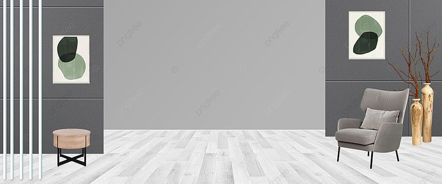
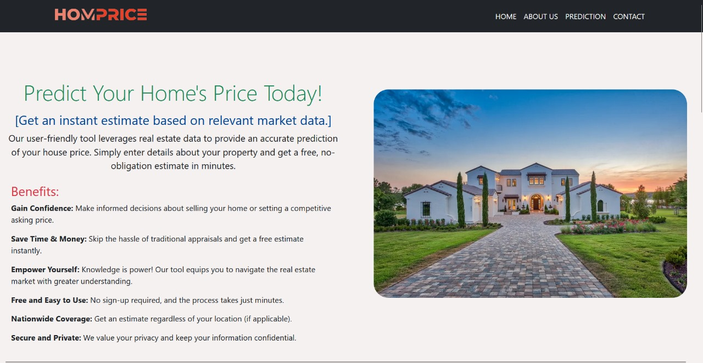
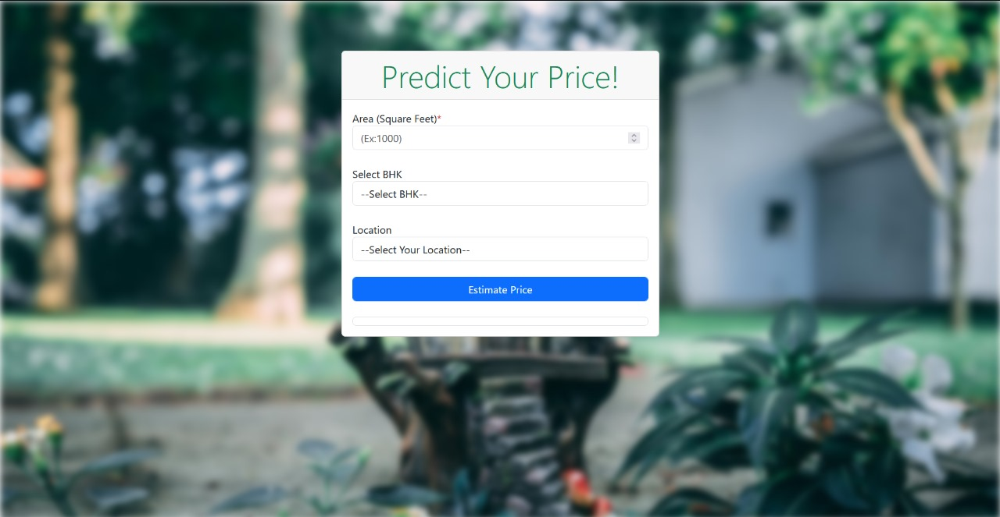
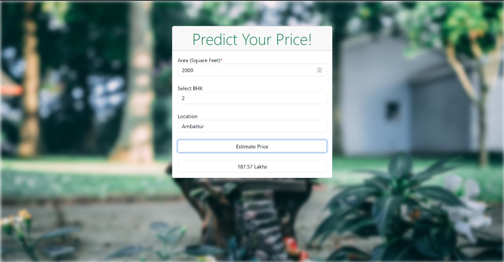

# Home Pick

Home Pick is a cutting-edge machine learning model designed to predict house prices in Chennai with remarkable accuracy. It harnesses historical data, current market trends, and a variety of features such as location, property size, and amenities to provide users with reliable price estimates. This model is particularly tailored for Chennai’s unique real estate landscape, making it an invaluable tool for buyers, sellers, and real estate professionals looking to make informed decisions in the vibrant Chennai housing market. With its user-friendly interface

### INSTALLATION

```
git clone https://github.com/VarunS21/House-Price-Prediction.git
```

```
cd home-pick
```

```
python -m pip install -r requirements.txt

```

```
.venv\Scripts\activate
```

### Execution

Run the application by double clicking the 'run.bat' file

or

```
python app.py
```

### Tech Stack and Tools used

-   Python 3.12
-   HTML5
-   CSS 3
-   Bootstrap
-   JS
-   VS Code
-   Jupyter note book

### Specifications

-   OS : Windows
-   Python version: > 3.10
-   Browser : Firefox / Chrome / Brave / Opera
-   Resolution : 1920 x 1080 / 1920 x 1200
-   Zoom level : 100%

### Screen shots

Explore our UI



Prediction page UI



Predict prices



## Contact

<div class="cards" style="
    width: 100%;
    display:flex;
    justify-content: space-evenly;">
    <div class="card" style="height:150px;
        width:44%;
        background:#ffc8dd;
        border-radius: 5px;
        padding:2%;
        color: #8338ec;">
        <h3>Varun S</h3>
        <h5>Backend(Flask) and Machine learning</h5>
        <hr style="background-color:#3a86ff; height:2px;"/>
        <div class='images' style="width:300px">
            <a href="mailto:varunsivakumar2002@gmail.com"></a>
            <a href="https://www.linkedin.com/in/varun-s-132197210/" ></a>
            <a href="https://github.com/VarunS21"></a>
        </div>
    </div>
    <div class="card" style="height:150px;
        width:44%;
        background:#ffc8dd;
        border-radius: 5px;
        padding:2%;
        color: #8338ec;">
        <h3>Pravin R K</h3>
        <h5>Front end and designing</h5>
        <hr style="background-color:#3a86ff; height:2px;"/>
        <div class='images' style="width:300px">
            <a href="mailto:rkpravin550@gmail.com">
            
        </a>
            <a href="https://www.linkedin.com/in/pravin-r-k-131aba287/">
            
        </a>
            <a href="https://github.com/Pravin-R-K"></a>
        </div>
    </div>
</div>
